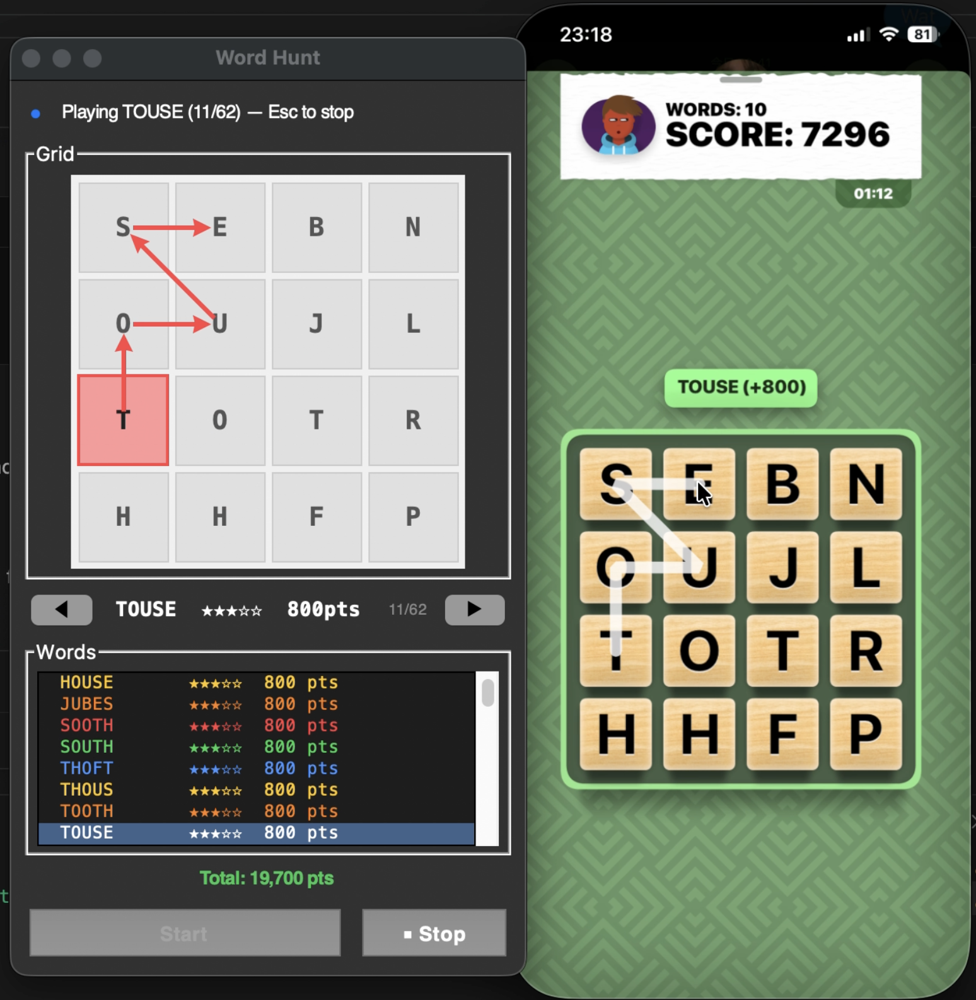

# Word Hunt Assistant

A Mac desktop tool that captures your iPhone Mirroring screen, OCRs the 4×4 letter grid, solves for every valid word, and auto-plays them all — dragging the mouse through each path on the game board automatically.



---

## Features

- **Auto-capture** — detects the iPhone Mirroring window and screenshots it instantly
- **OCR grid recognition** — reads all 16 tiles using PaddleOCR
- **Full solver** — DFS with prefix pruning finds every valid word path, sorted longest-first
- **GUI control panel** — floating always-on-top window showing the grid, word paths, scores, and word list
- **Auto-play** — sends mouse drag events directly to iPhone Mirroring to play every word automatically
- **Escape to stop** — press Esc at any time to halt auto-play (no Accessibility permission needed)
- **Word cycling** — ◀ / ▶ buttons (or arrow keys) to browse words manually

---

## Tech Stack

| Layer | Library |
|---|---|
| Screen capture | `mss` |
| OCR | `PaddleOCR` (v3) |
| Image processing | `OpenCV`, `Pillow`, `NumPy` |
| Mouse automation | `Quartz CGEvent` (pyobjc) |
| Window detection | `Quartz CGWindowList` (pyobjc) |
| GUI | `tkinter` |
| macOS integration | `AppKit`, `Foundation` (pyobjc) |

Requires **macOS** with **iPhone Mirroring** (macOS Sequoia+).

---

## Setup

**1. Clone the repo**
```bash
git clone https://github.com/welchj/wordhunt-assistant.git
cd wordhunt-assistant
```

**2. Create a virtual environment (recommended)**
```bash
python3 -m venv venv
source venv/bin/activate
```

**3. Install dependencies**
```bash
pip install -r requirements.txt
pip install pyobjc-framework-Quartz pyobjc-framework-AppKit
```

**4. Grant Screen Recording permission**

Go to **System Settings → Privacy & Security → Screen Recording** and add your terminal or Python interpreter. This is required for `mss` to capture the iPhone Mirroring window.

**5. Run**
```bash
python main.py
```

---

## Controls

| Action | How |
|---|---|
| Capture + solve | Click **Start** |
| Auto-play all words | Click **▶ Play All** |
| Stop auto-play | Press **Esc** |
| Browse words | **◀ / ▶** buttons or arrow keys |
| Jump to a word | Click it in the word list |

When you click **▶ Play All**, switch to iPhone Mirroring within the brief lead-in — the tool will drag through every word path automatically.

---

## Project Structure

```
main.py        — entry point
gui.py         — floating control panel (tkinter)
capture.py     — iPhone Mirroring window detection + screenshot
grid.py        — grid layout + PaddleOCR cell recognition
solver.py      — DFS word solver with prefix pruning
overlay.py     — (unused) early NSWindow overlay experiment
wordbank.txt   — word list used for solving
```

---

## Wordbank

The solver checks found words against `wordbank.txt`. This list does **not** include every word that Game Pigeon's Word Hunt accepts — there are uncommon words, proper nouns, and game-specific entries that may be missing. As a result, some valid in-game words won't be found, and the displayed score is a lower bound on what's achievable.

Contributions to expand or improve the wordbank are very welcome.

---

## Limitations & Known Issues

- Grid coordinates are hardcoded for a standard iPhone Mirroring window size (~316×696 pt). If your window is a different size, auto-play clicks may land off-target.
- Auto-play requires **Accessibility permission** for `CGEventPost` to send mouse events to another app (System Settings → Privacy & Security → Accessibility).
- OCR occasionally misreads a tile; re-running Start usually fixes it.

---

## Contributing & Future Work

This is an early-stage project and there's a lot of room to grow. Contributions, ideas, and PRs are welcome on any of the following:

- **Wordbank expansion** — add missing words that Word Hunt accepts
- **Dynamic grid calibration** — auto-detect grid position for any window size instead of hardcoded constants
- **Score optimization** — play highest-value words first, or skip short words below a threshold
- **Multi-game support** — adapt the tool to other Game Pigeon word games
- **Windows/Linux support** — replace macOS-specific capture and mouse APIs
- **Better OCR** — handle rotated tiles or unusual fonts

Feel free to open an issue or submit a pull request!
